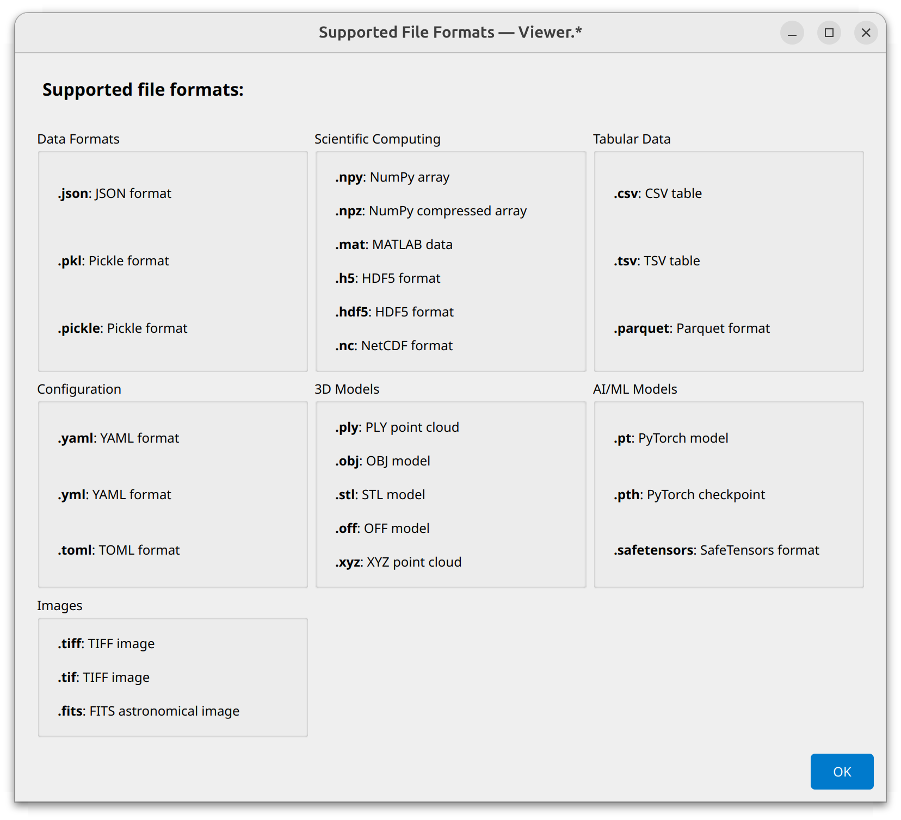
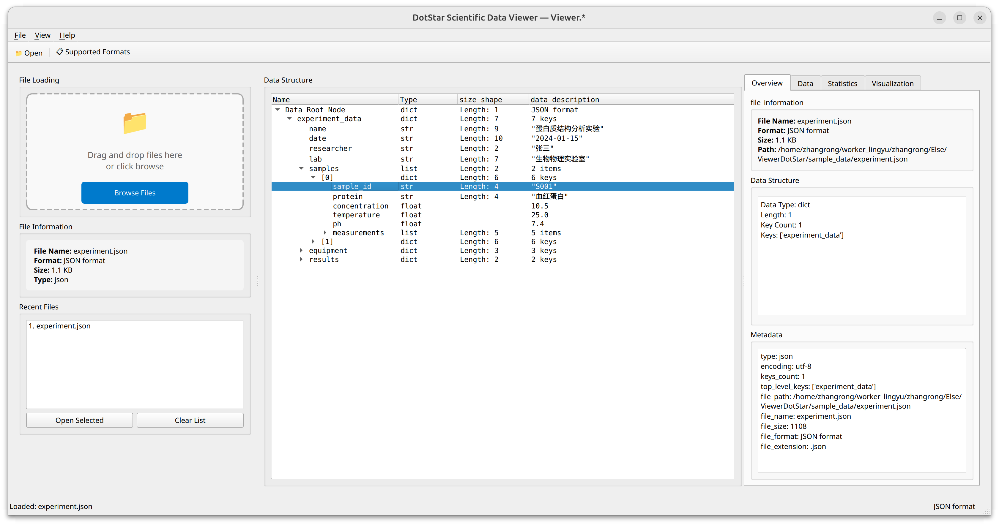

# Viewer Dot Star (Viewer.*)

A multi-format data file browser tool designed for researchers, liberate you from annoying intermediate steps of data processing and pdb breakpoints when processing data and replicating others' papers.

Now it supports ubuntu only.

## Features

- **File Format Support**: 
- **Data Inspection**: Tree view, multiple display modes, statistical analysis
- **User Interface**: Drag & drop, recent files, multi-language support; Support for both high-DPI and low-DPI displays

## Installation
Python 3.8 ~ 3.11 is supported.

```bash
git clone https://github.com/cowboy446/ViewerDotStar.git
cd ViewerDotStar
pip install -r requirements.txt
python main.py
```


## Usage
1. Launch: `python main.py`
2. Load files: `Drag & drop` or `File -> Open`
3. Explore data in tree view and detail panels

    

## License

[MIT License](https://opensource.org/licenses/MIT)
